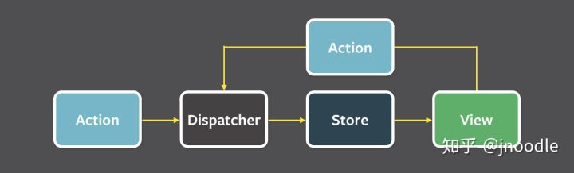

* Flux、Vuex、Redux、Mobx比较
  出处：[Vuex、Flux、Redux、Redux-saga、Dva、MobX - 知乎 ](https://zhuanlan.zhihu.com/p/53599723)
  都是状态管理工具：把组件之前需要共享的状态抽出来，遵循特定的约定，统一管理，让状态的变化变得可以预测。
  - Flux 
    - 把应用分为4个部分：View、Action、Dispatcher、Store
    - 最大的特点是数据是单向数据流
    - 缺点：一个应用可以拥有多个 Store，多个Store之间可能有依赖关系
  
  - Redux
    - 只有一个Store，store的 state 不能直接修改，每次只能返回一个新的 state，可以使用 store.subscribe 方法监听函数
    - 使用 Reducer 的纯函数来处理事件，计算返回新的 State
    - 处理异步：在发起请求时刻、和接受响应时刻都可以修改应用 State，react-chunk
  
  - Flux和Redux异同点：React单一数据源，Flux数据源可以是多个；State 是可读的，Flux的 State 可以随便改；使用纯函数来执行修改，Flux 执行修改不一定是纯函数（纯函数就是没有副作用的函数，相同输入可能导致不同的输出）
  - Vuex
    - Vuex 通过 store 选项，把 state 注入到整个引用
    - Mutation: 类似 Redux 的 Reducer，但是不用每一次都搞一个新的 State，可以直接修改 State。（据尤大的说法，Redux 强制的 immutability，在保证了每一次状态变化都能追踪的情况下强制的 immutability 带来的收益很有限，为了同构而设计的 API 很繁琐，必须依赖第三方库才能相对高效率地获得状态树的局部状态，这些都是 Redux 不足的地方，所以也被 Vuex 舍掉了。）
    - Action: Vuex的想法是把同步和异步拆分，Action 里面不管执行多少异步操作，最后都通过commit(action)来触发mutation， 一个Action可以触发多个 Mutation
    - Module: 拆分 State，每一个module有自己的state、Mutation、action、getter
  - Mobx
    - 思想： 任何源自应用状态的东西都应该自动地获得（状态只有一变，其他用到状态的地方就跟着自动变）
    - 允许多个Store，而且state可以直接修改
    - View 更新很精确，粒度控制很细
    - 没有中间件，副作用处理比较自由，没有约束

