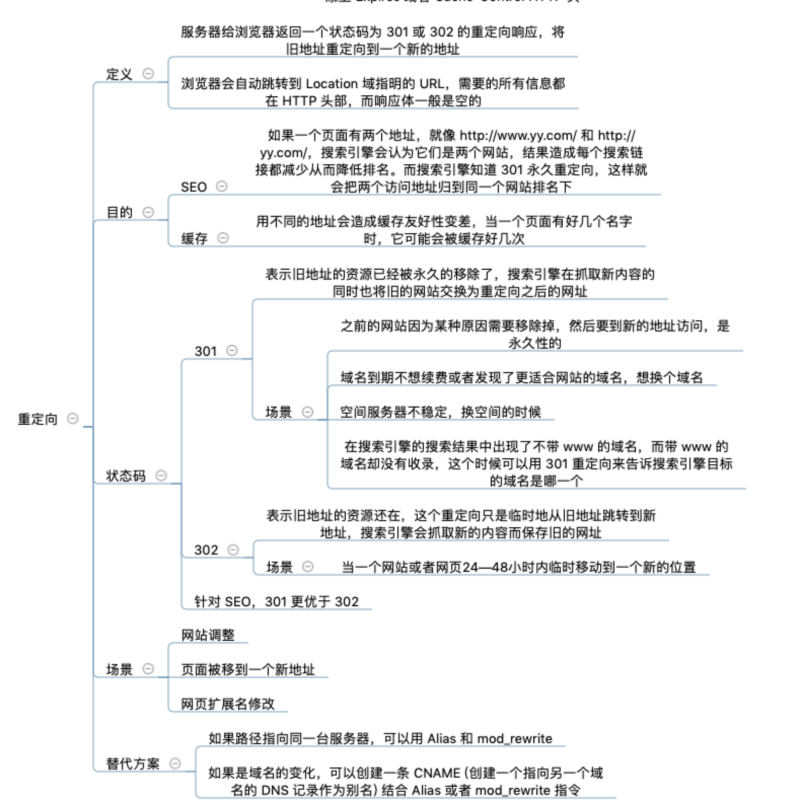

* 前端异常监控  
  代码运行错误通常的办法是使用window.onerror拦截报错，对于异步代码，可以使用catch方式捕获错误，同步代码就用async await就使用try catch

* 简单讲解一下 http2 的多路复用？
  HTTP2采用二进制格式传输，取代了HTTP1.x的文本格式，二进制格式解析更高效。(tip: 与HTTP1.0的区别)
  多路复用代替了HTTP1.x的序列和阻塞机制，所有的相同域名请求都通过同一个TCP连接并发完成。在HTTP1.x中，并发多个请求需要多个TCP连接，浏览器为了控制资源会有6-8个TCP连接数限制。

  在HTTP2中（tip: 多路复用特点）
   - 同域名下所有通信都在单个连接上完成，消除了因多个 TCP 连接而带来的延时和内存消耗。
   - 单个连接上可以并行交错的请求和响应，之间互不干扰

* UDP与TCP的区别是什么？  
  UDP协议是面向无连接的，不需要在正式传递数据之前先链接起双方。UDP协议只是数据报文的搬运工，不保证有序且不丢失的传递到对端，并且UDP协议也没有任何控制流量的算法，总的来说UDP相对于TCP更加轻便。  
  - 面向无连接。  
  - 不可靠性。通信都不需要建立连接，想发就发。  
  - 高效。没有TCP那么复杂，需要保证数据不丢失且有序到达。因此UDP的头部开销小，只有八字节，相比TCP的至少二十字节要少得多，在传输数据报文时是很高效的。  
  - 传输方式。不止支持一对一，同样还支持一对多，多对多，多对一的方式。

* TCP连接的建立，三次握手过程。(https://blog.csdn.net/qq_38950316/article/details/81087809)  
  由于TCP是有状态的一来一回的连接，只有客户端才能先行发起。
  - 第一次握手：建立连接时，客户端发送syn包（syn=j）到服务器，并进入SYN_SENT状态，等待服务器确认；SYN：同步序列编号（Synchronize Sequence Numbers）
  - 第二次握手：服务器收到syn包，必须确认客户的SYN（ack=j+1），同时自己也发送一个SYN包（syn=k），即SYN+ACK包，此时服务器进入SYN_RECV状态；
  - 第三次握手：客户端收到服务器的SYN+ACK包，向服务器发送确认包ACK(ack=k+1），此包发送完毕，客户端和服务器进入ESTABLISHED（TCP连接成功）状态，完成三次握手。

* TCP连接的关闭，四次挥手过程，断开的过程，客户端和服务端都可以发起  
  i.客户端发送 Fin 字段告诉服务端，希望关闭连接，客户端处理 Fin wait 1 阶段（终止等待第一阶段）；  
  ii. 服务端收到信号，返回 ack 确认包给客户端，并告诉客户端服务端仍可能有上次的数据未处理完毕，我正在处理中，你仍可以接收我可能发给你客户端的数据，我先处于 close wait状态直至我处理完毕，客户端当前处于终止 Fin wait 1 阶段，进入 Fin wait 2 阶段（终止等待第二阶段）；  
  iii. 服务端在处理完之前的数据后，发送 Fin 信号以及 ack 确认包给客户端，告诉客户端服务端已经处理完毕，已经可以开始关闭连接了；  
  iv. 客户端收到服务端发来的 Fin 信号后，再次向服务端发送 ack 确认包，告诉服务端自己已经收到关闭命令了，自己正在执行关闭连接的过程，此时客户端处于 Time wait 阶段，等待关闭连接，服务端收到 ack 后立刻就关闭了 TCP 连接，在等待了 2MSL（最长报文段寿命） 后，客户端也关闭了 TCP 连接；  
  简易版  
  - 客户端 -- FIN --> 服务端， FIN—WAIT
  - 服务端 -- ACK --> 客户端， CLOSE-WAIT
  - 服务端 -- ACK,FIN --> 客户端， LAST-ACK
  - 客户端 -- ACK --> 服务端，CLOSED

* 为什么连接的时候要三次握手，关闭的时候要四次握手  
  i.三次握手的过程缺一不可，第一次客户端发送请求，第二次服务端确认连接请求，第三次客户端确认可连接请求，清晰可见上面的 TCP 连接建立过程，其中少一个步骤都无法建立，多一个步骤则造成冗余，降低效率；  
  ii. 四次握手都是必须的，第一次终止信号是必须的，这个不用说，第二次服务端仍可能在处理上次的连接，所以 ack 确认包告诉客户端已经确认，但是请等待我处理完这是必须的，处理完毕后第三次发送 Fin 信号告诉客户端我可以关闭了，第二与第三次是不能一起发送的，因为要等待服务端将可能剩余的报文处理完毕；  
  有疑问的只有第四次，为什么客户端还要发送 ack 确认包给服务端，确认服务端收到才完全关闭？这是因为我们要假定网络是不可靠的，可能存在掉线的可能，所以最后一次客户端要确认服务端再次收到后才能关闭，否则客户端将一直重发第四次的 ack 包去确认服务端仍在线并接收到了，直至服务端确认了，客户端才彻底关闭连接，第四次的等待确认时间是 2MSL（MSL 指一个片段在网络中的最大存活时间，2 倍是因为第四次 客户端 发送 ack 给服务端后，此时服务端知道可以完全关闭连接了，就会关闭并且不会再回复 Fin 信号回去，而客户端在没有等待到最后一次 Fin 信号时就知道服务端肯定是收到第四次的 ack 包，自己也可以放心的完全关闭连接了），所以客户端在第四次等待的 2MSL 一个是 ack 发送的时间，一个是确认服务端没掉线，自己等待不会到的 Fin 信号的时间。

* 为什么TCP建立连接需要三次握手，明明2次就可以了  
  因为这是为了**防止出现失效的连接请求报文段被服务端接收**的情况，从而产生错误。客户端在网络超时的时候会启动超时重传机制再次发送一个请求，如果之前的请求在两端关闭后才到达服务端，服务端端以为客户端又需要建立TCP链接，就会进入等待，造成资源的浪费。

* TCP拥塞处理
  - 慢开始，传输开始时发送窗口慢慢指数级扩大，避免一开始就传输大量数据导致网络拥塞。
  - 拥塞避免，发送窗口大小只加一。
  - 快速重传。
  - 快速恢复。

* http2 与 http1.X 相比的新特性
  - **新的二进制格式（Binary Format** HTTP1.x的解析是基于文本。基于文本协议的格式解析存在天然缺陷，文本的表现形式有多样性，要做到健壮性考虑的场景必然很多，二进制则不同，只认0和1的组合。基于这种考虑HTTP2.0的协议解析决定采用二进制格式，实现方便且健壮。
  - **多路复用（MultiPlexing）** 即连接共享，即每一个request都是是用作连接共享机制的。一个request对应一个id，这样一个连接上可以有多个request，每个连接的request可以随机的混杂在一起，接收方可以根据request的 id将request再归属到各自不同的服务端请求里面。
  - **header压缩**，如上文中所言， 对前面提到过 HTTP1.x 的header带有大量信息，而且每次都要重复发送，HTTP2.0使用encoder来减少需要传输的header大小，通讯双方各自cache一份header fields表，既避免了重复header的传输，又减小了需要传输的大小。
  - **服务端推送（server push）** 同SPDY一样，HTTP2.0也具有server push功能。

* 缓存策略：可分为**强缓存**和**协商缓存**
  - Cache-Control/Expires: 浏览器判断缓存是否过期，未过期时，直接使用强缓存，**Cache-Control的max-age优先级高于Expires**
  - 缓存已经过期，使用协商缓存
    - 唯一标识方案：Etag(response携带) & If-None-Match(request携带，上一次返回的Etag)，服务器判断资源是否被修改
    - 最后一次修改时间：Last-Modified(response) & If-Modified-Since(reques, 上一次返回的Last-Modified)
      - 如果一致，直接返回304通知浏览器使用缓存
      - 不一致，服务端返回新资源
    - Last-Modified缺点
      - 周期性修改，但内容未变时，会导致缓存失效
      - 最小粒度到s，s以内的改动无法检测到
    - Etag的优先级高于Last-Modified

* Websocket
  websocket是一个持久化的协议，基于http，服务端可以主动push
  - 兼容
    - FLASH Socket
    - 长轮询： 定时发送Ajax
    - long poll: 发送->有消息再response
  - 过程
    - new Websockt(ws://...)
    - ws.onerror = fn
    - ws.onclose = fn
    - ws.onopen = fn
    - ws.onmessage = fn
    - ws.send()

* 常见的状态码
  - 1XX: 信息状态码
    - 100 继续，一般在发送post请求时，已经发送了http header之后服务端将返回此信息，表示确认，之后发送具体参数信息
  - 2XX: 成功状态码
    - 200 OK 成功返回信息
    - 201 Created 请求成功并创建了资源
    - 202 Accepted 服务器已接受请求，但尚未处理
  - 3XX: 重定向
    - 301 Moved Permanently请求的网页已永久移动到新位置
    - 302 临时性重定向
    - 304 No Modified 上次请求后，请求的网页未修改
  - 4XX: 客户端错误
    - 400 Bad Request 服务器无法理解请求的格式
    - 401 请求未授权
    - 403 禁止访问
    - 404 找不到
  - 5XX: 服务器错误
    - 500 服务器内部错误
    - 503 暂时无法处理请求（过载或者维护）

* get和post的区别  
  - get相当于查找过程，用户获取数据，不用和数据库连接，所以可以缓存，post一般是修改和删除，所以不能使用缓存
  - post相对get安全一点，get请求会包含在url里，且会被浏览器保存历史记录，Post不会
  - 浏览器会限制URL长度，会影响Get请求
  - post可以通过request body 传输比 Get 更多的数据
  - post支持更多的编码类型且不对数据类型限制

* HTTPS 握手过程  
  1.客户端使用https的url访问web服务器,要求与服务器建立ssl连接
  2.web服务器收到客户端请求后, 会将网站的证书(包含公钥)传送一份给客户端
  3.客户端收到网站证书后会检查证书的颁发机构以及过期时间, 如果没有问题就随机产生一个秘钥
  4.客户端利用公钥将会话秘钥加密, 并传送给服务端, 服务端利用自己的私钥解密出会话秘钥
  5.之后服务器与客户端使用秘钥加密传输

* HTTPS 握手过程中，客户端如何验证证书的合法性
  1、首先什么是HTTP协议?  
  http协议是超文本传输协议，位于tcp/ip四层模型中的应用层；通过请求/响应的方式在客户端和服务器之间进行通信；但是缺少安全性，http协议信息传输是通过明文的方式传输，不做任何加密，相当于在网络上裸奔；容易被中间人恶意篡改，这种行为叫做中间人攻击；
  2、加密通信：  
  为了安全性，双方可以使用对称加密的方式key进行信息交流，但是这种方式对称加密秘钥也会被拦截，也不够安全，进而还是存在被中间人攻击风险；  
  于是人们又想出来另外一种方式，使用非对称加密的方式；使用公钥/私钥加解密；通信方A发起通信并携带自己的公钥，接收方B通过公钥来加密对称秘钥；然后发送给发起方A；A通过私钥解密；双发接下来通过对称秘钥来进行加密通信；但是这种方式还是会存在一种安全性；中间人虽然不知道发起方A的私钥，但是可以做到偷天换日，将拦截发起方的公钥key;并将自己生成的一对公/私钥的公钥发送给B；接收方B并不知道公钥已经被偷偷换过；按照之前的流程，B通过公钥加密自己生成的对称加密秘钥key2;发送给A；
  这次通信再次被中间人拦截，尽管后面的通信，两者还是用key2通信，但是中间人已经掌握了Key2;可以进行轻松的加解密；还是存在被中间人攻击风险；

  3、解决困境：权威的证书颁发机构CA来解决；  
  3.1制作证书：作为服务端的A，首先把自己的公钥key1发给证书颁发机构，向证书颁发机构进行申请证书；证书颁发机构有一套自己的公私钥，CA通过自己的私钥来加密key1,并且通过服务端网址等信息生成一个证书签名，证书签名同样使用机构的私钥进行加密；制作完成后，机构将证书发给A；  
  3.2校验证书真伪：当B向服务端A发起请求通信的时候，A不再直接返回自己的公钥，而是返回一个证书；
  说明：各大浏览器和操作系统已经维护了所有的权威证书机构的名称和公钥。B只需要知道是哪个权威机构发的证书，使用对应的机构公钥，就可以解密出证书签名；接下来，B使用同样的规则，生成自己的证书签名，如果两个签名是一致的，说明证书是有效的；
  签名验证成功后，B就可以再次利用机构的公钥，解密出A的公钥key1;接下来的操作，就是和之前一样的流程了；  
  3.3：中间人是否会拦截发送假证书到B呢？
  因为证书的签名是由服务器端网址等信息生成的，并且通过第三方机构的私钥加密中间人无法篡改； 
  所以最关键的问题是证书签名的真伪；

  4、https主要的思想是在http基础上增加了ssl安全层，即以上认证过程；

* 介绍下 HTTPS 中间人攻击
  https协议由 http + ssl

  中间人攻击过程如下：

  1.服务器向客户端发送公钥。
  2.攻击者截获公钥，保留在自己手上。
  3.然后攻击者自己生成一个【伪造的】公钥，发给客户端。
  4.客户端收到伪造的公钥后，生成加密hash值发给服务器。
  5.攻击者获得加密hash值，用自己的私钥解密获得真秘钥。
  6.同时生成假的加密hash值，发给服务器。
  7.服务器用私钥解密获得假秘钥。
  8.服务器用加秘钥加密传输信息

  防范方法：
  服务端在发送浏览器的公钥中加入CA证书，浏览器可以验证CA证书的有效性

* 永久行重定向（301）和临时性重定向（302）对SEO有什么影响？
  

* 接口防刷
  1：网关控制流量洪峰，对在一个时间段内出现流量异常，可以拒绝请求（当请求到达 API 网关时，它会递增相应的请求计数器并检查这个递增是否超过单位时间内最大允许请求数。 如果超过，则拒绝这个请求，最常见的情况是向调用客户端返回 “Too Many Requests” HTTP 429 状态码。）
  2：源ip请求个数限制。对请求来源的ip请求个数做限制
  3：http请求头信息校验；（例如host，User-Agent，Referer）
  4：对用户唯一身份uid进行限制和校验。例如基本的长度，组合方式，甚至有效性进行判断。或者uid具有一定的时效性
  5：前后端协议采用二进制方式进行交互（protobuf）或者协议采用签名机制
  6：人机验证，验证码，短信验证码，滑动图片形式，12306形式

* 为什么HTTP 1.1不能实现多路复用
  HTTP1.x是序列和阻塞机制
  HTTP 2.0 是多路复用TCP连接，在一个连接里，客户端和浏览器都可以同时发送多个请求或回应，而且不用按照顺序一一对应，这样就避免了"队头堵塞"。

    - 举例来说，在一个TCP连接里面，服务器同时收到了A请求和B请求，于是先回应A请求，结果发现处理过程非常耗时，于是就发送A请求已经处理好的部分， 接着回应B请求，完成后，再发送A请求剩下的部分。

    - 旧的http1.1是会等A请求完全处理完后再处理B请求，会阻塞

  另：http1.1已经实现了管道机制：即 在同一个TCP连接里面，客户端可以同时发送多个请求。http 1.0并做不到，所以效率很低

