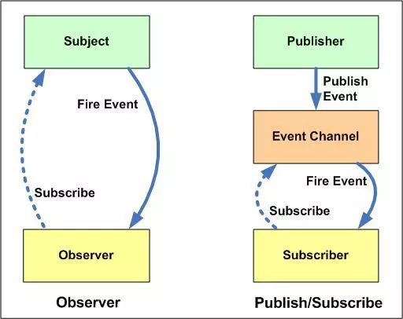

知识点查缺补漏

- [x]单例模式（sdk单例模式，浏览器window就是单例）
- [x]订阅发布者
- [x]观察者模式

- [x]策略模式
- [x]虚拟化列表
- []base64编程原理
- [x]继承模式
- []项目介绍
- []node
- [x]http
- [x]缓存
- [x]性能优化
- []egg实现多线程
- []浏览器
- []深拷贝
- [x]vuex、reduce、mobx的区别
- []webpack
- []小程序